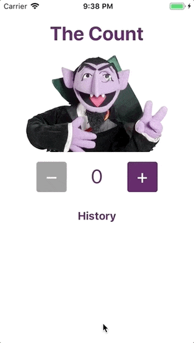

# The Count

This is a counter app built with [React Native](https://facebook.github.io/react-native/) and [Expo](https://expo.io/). It is intended to show the essential parts of a React Native app.

## Installation

- Ensure you have one of the following:
  - An iPhone with the [Expo](https://itunes.apple.com/app/apple-store/id982107779?mt=8) app
  - An Android phone with the [Expo](https://play.google.com/store/apps/details?id=host.exp.exponent) app
  - (Via [Xcode](https://developer.apple.com/xcode/)) the iOS Simulator with the [Expo](https://expo.io/tools) app
  - An Android emulator with the [Expo](https://expo.io/tools) app ([Genymotion emulator](https://www.genymotion.com/fun-zone/) is recommended)
- Ensure you have the following installed on your computer:
  - [Node.js](https://nodejs.org/)
  - [Google Chrome](https://google.com/chrome/)
- Clone this repository and `cd counter-app`
- Run `npm` to install dependencies.

## Running app

- In your terminal, type `npm start`.
- If you are using a device:
  - Ensure your device is on the same network as your computer.
  - Scan the resulting QR code with the Expo app. You should see the app appear in our device.
- If you have the iOS simulator installed, type `i` in the interactive prompt to open the app in the simulator.
- If you have an Android emulator installed, type `a` in the interactive prompt to open the app in the simulator.

## Troubleshooting

### Expo app can't connect to development server

- Ensure your computer and device are on the same network.
- If you are on Windows, and have VirtualBox or VMWare installed, `yarn start` might not work properly. [Follow these instructions to solve](https://github.com/react-community/create-react-native-app/issues/60#issuecomment-317104728).

## Notes

### Directory Structure

- `babel.config.js`: a config file used by the [Babel](https://babeljs.io/) transpiler.
- `.gitignore`: a file used by git to determine which files and folders should not be version controlled.
- `App.js`: the main Counter component to be rendered to the screen.
- `app.json`: a config file used by the Expo app.
- `count.jpg` files: an image used by the app, in three sizes to satisfy different devices' pixel densities.
- `package.json`: a config file to store the project's dependencies and define scripts to be run with `npm`.
- `package-lock.json`: a complete list of all dependencies used by the app, accessed by `npm` when the development environment is initially set up.

### Development

The Expo client app enables _Live Reload_ by default. This means that any changes that are saved in your text editor will cause the app on the device to be refreshed.

Shaking the device will reveal the Developer Menu, where you can manually reload, enable remote debugging and inspect the component tree. Enabling remote JS debugging will open Google Chrome where you can step through your code and set breakpoints.

## License

MIT
